<a id="readme-top"></a>

<div align="center">
  <a href="https://github.com/WAY29/poe2-marketwright">
    
  </a>

  <h1>PoE2 Marketwright</h1>

  <p>《流放之路 2》官方市集的 Chromium 浏览器扩展。</p>

  <p>
    <a href="#features"><strong>查看功能</strong></a>
    ·
    <a href="https://github.com/WAY29/poe2-marketwright/releases">下载发布包</a>
    ·
    <a href="https://github.com/WAY29/poe2-marketwright/issues">报告问题</a>
  </p>

  <p>
    <a href="README.md">English</a>
    ·
    <a href="README.zh-CN.md">简体中文</a>
  </p>
</div>

> [!IMPORTANT]
> 本项目主要通过 AI 辅助的 vibe coding 开发。如果这不符合你的预期，请不要使用。功能仍可能存在缺陷，例如词缀过滤和 PoB 复制；请通过 [Issue](https://github.com/WAY29/poe2-marketwright/issues) 提交可复现的问题。

<details>
  <summary>目录</summary>
  <ol>
    <li><a href="#about">关于项目</a></li>
    <li><a href="#features">功能介绍</a></li>
    <li><a href="#getting-started">开始使用</a></li>
    <li><a href="#data">数据与本地化</a></li>
    <li><a href="#license">许可</a></li>
    <li><a href="#acknowledgments">致谢</a></li>
  </ol>
</details>

<a id="about"></a>
## 关于项目

PoE2 Marketwright 为官方 [`trade2`](https://www.pathofexile.com/trade2) 页面提供市集增强功能：本地化、词缀筛选与搜索、Tier 选择、物品及搜索链接收藏、PoB 复制，以及固定报价的通货换算。扩展会直接在市集页面内工作，不替代官方交易网站。

### 技术与数据

- Chrome Extensions Manifest V3
- 官方国际服、国服与台服 Trade 数据接口
- [PoE2DB](https://poe2db.tw/us/) 词缀与物品分类数据
- [Poe2Scout](https://poe2scout.com/) 参考通货汇率

<a id="features"></a>
## 功能介绍

### 网页汉化与 UI 多语言

市集页面可切换为简体中文或繁体中文；扩展控制界面可独立切换为 English、简体中文或繁體中文。物品、类别和词缀选择器接受英文、简体中文及繁体中文输入，并会定位到同一个官方市集选项。数据来自国服与台服市集页面，以及 PoE2DB。

<p align="center">
  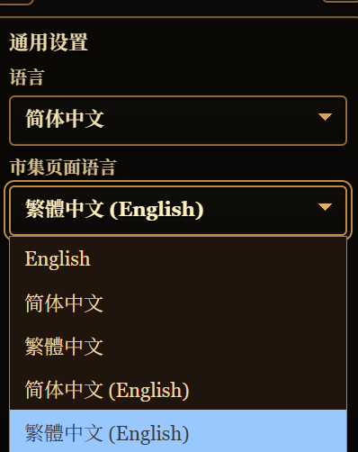
  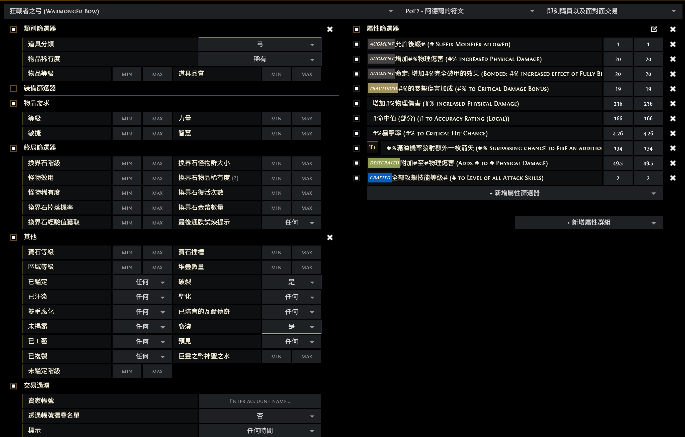
</p>

### 词缀过滤

扩展会根据所选物品类型或具体物品名称，只保留该物品可能拥有的词缀，并隐藏其他不相关的候选项。

以带暴击率的弓为例：未开启过滤时，搜索 `暴擊率` 会出现多个来自不同物品类型的词缀，选错后会直接搜不到结果。开启过滤后，候选列表会收敛为弓可拥有的对应词缀。

<p align="center">
  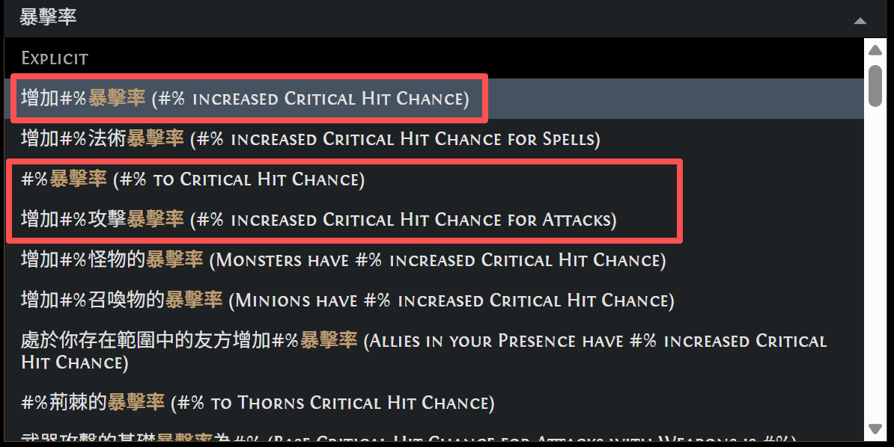
  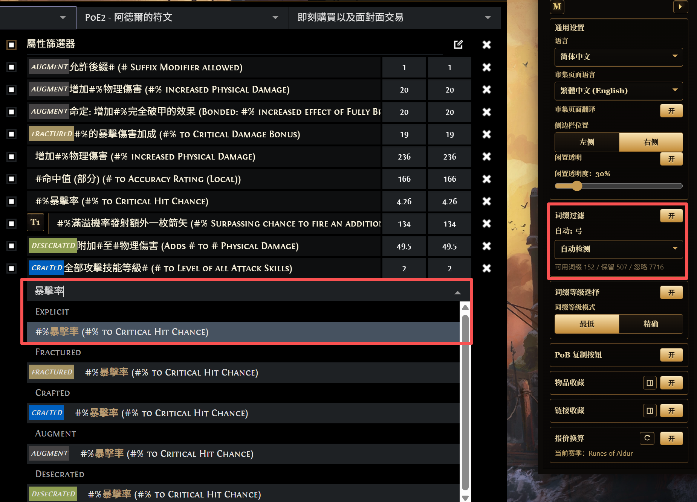
</p>

### 词缀搜索增强

在物品和词缀选择器中，可用 ASCII 空格分隔多个关键字进行模糊搜索。候选项必须包含全部词，因此 `金 戒指` 可以匹配 `金光戒指`，命中词会分别高亮。官方市集也提供相近行为，但需要以 `~` 开头；本扩展默认启用多词搜索，不影响单词搜索或手动输入的 `~` 查询。

<p align="center">
  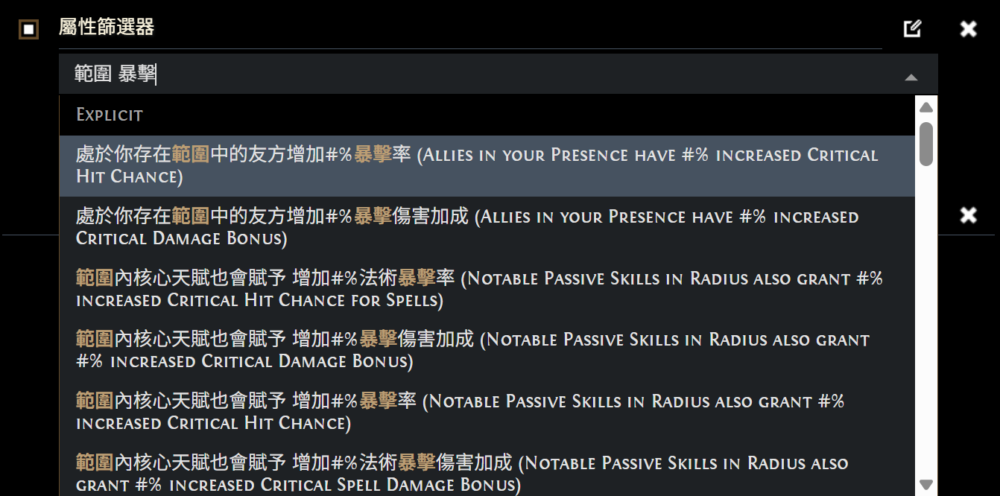
</p>

### 词缀等级选择

支持 Tier 的词缀会在左侧显示 `T` 按钮，可直接选择词缀等级。

- 已选择物品类型或具体物品名时，只显示该物品对应的 Tier。
- 未选择物品类型或具体物品名时，列表会标注兼容的物品类型，方便在多个可能来源之间选择。
- `最低` 是默认模式，只写入 `MIN` 并保留现有 `MAX`；`精确` 会同时写入该 Tier 的平均 `MIN` 与 `MAX` 范围。

<p align="center">
  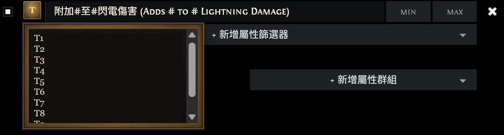
  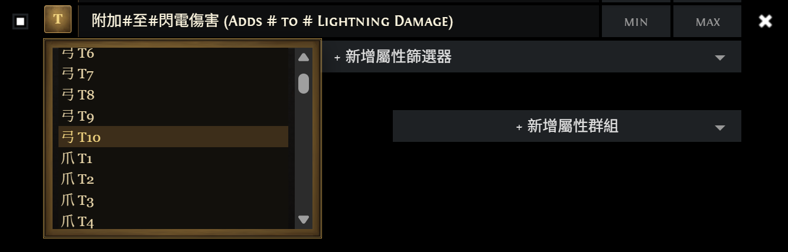
</p>

Tier 映射由已验证的 PoE2DB 词缀范围生成，并按官方 Trade 稳定词缀 ID 匹配；无法唯一映射的词缀不会显示该选择器。对于点伤等区间重叠的词缀，选择 T1 仍可能搜到 T2，因为筛选填写的是平均值而非完整词缀区间。

### 词缀快速添加

点击 `新增属性筛选器` 右侧的 `+` 按钮即可开启快速添加模式。正常添加一个词缀后，选择器会立即重新打开，并保留当前搜索关键词，便于连续添加；再次点击该按钮即可关闭模式。

<p align="center">
  
</p>

按住 `Shift` 并左键单击候选词缀可暂存而不立即加入搜索条件。暂存项会高亮显示；点击列表右下角的 `添加 N 个暂存词缀` 后，可一次性加入当前词缀组。

<p align="center">
  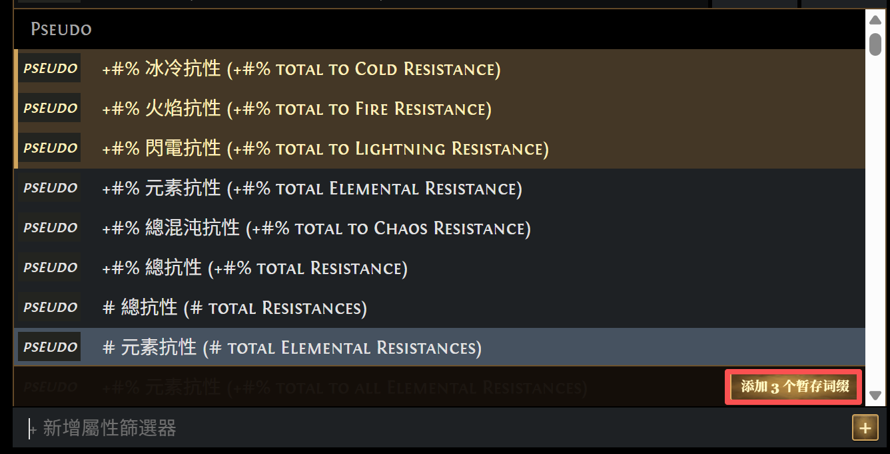
</p>

### 物品收藏

暂时买不起的物品可以先收藏。开启此功能后，结果行的物品图标下方会出现收藏按钮；收藏视图可快速回到此前的物品，并支持新建文件夹、分类管理和预览物品的筛选条件与词缀。

<p align="center">
  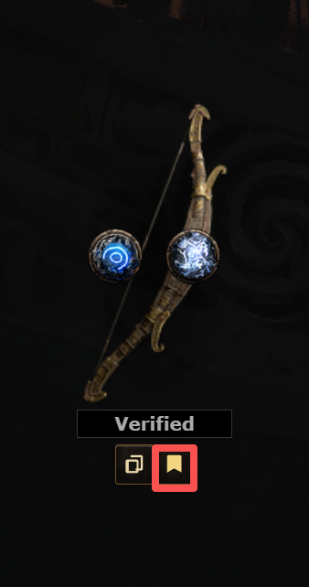
  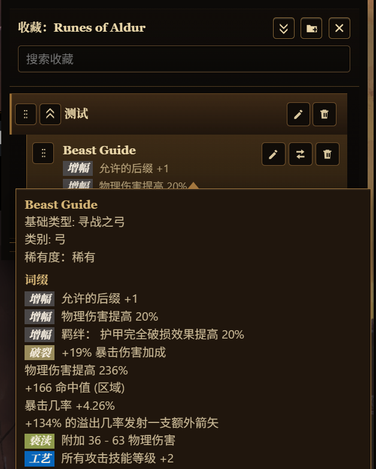
</p>

### 链接收藏与历史

链接收藏会保存当前搜索链接及其完整搜索条件，便于快速回到某类物品。可在收藏视图中创建文件夹、分类管理，并预览链接的筛选条件与词缀。

<p align="center">
  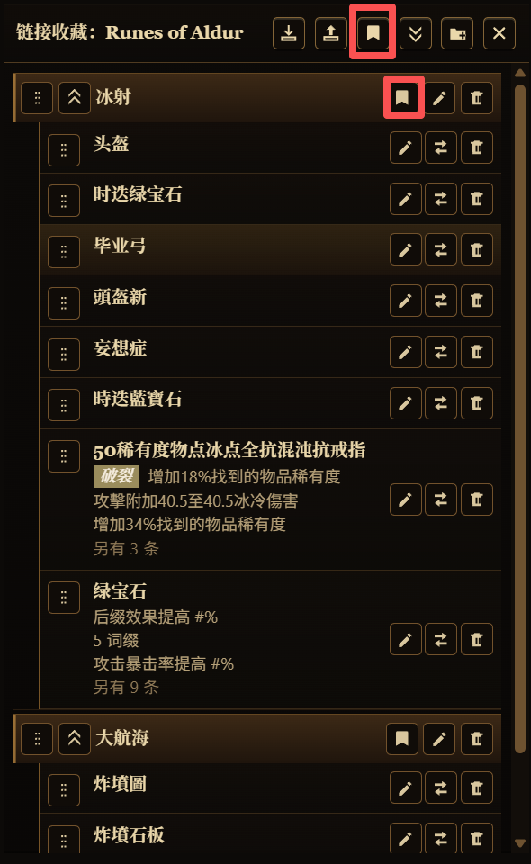
</p>
另外搜索历史也会自动存储,在链接收藏的最底下,如图所示:

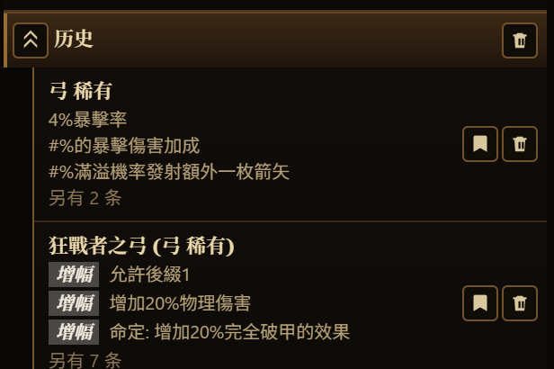

### PoB 复制按钮

想确认一件装备是否提升角色时，点击结果行物品图标下方的 `复制到 PoB`，扩展会将物品文本复制到剪贴板，方便导入 Path of Building 的 Create Custom。

<p align="center">
  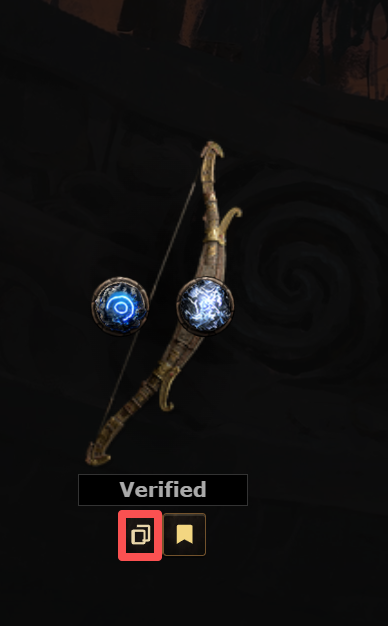
  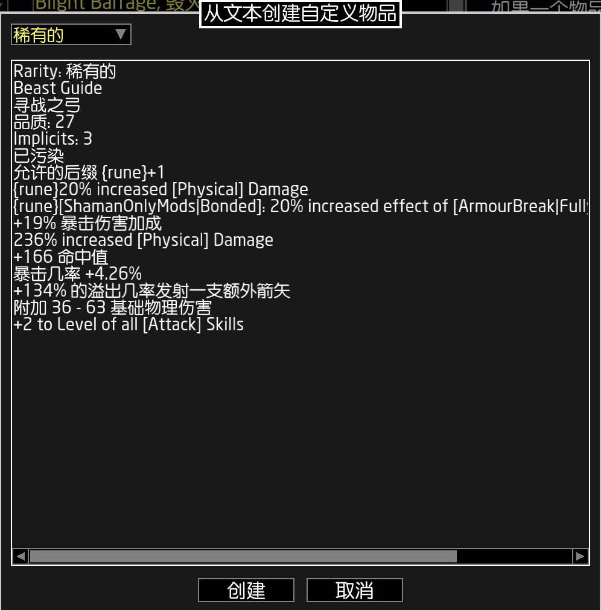
</p>

### 报价换算

搜索条件使用“等同崇高石”的直购价时，结果可能同时包含混沌石、崇高石和神圣石报价。固定 `~price` 与 `~b/o` 报价会显示 `E`、`C`、`D` 换算按钮，可快速比较价格。

<p align="center">
  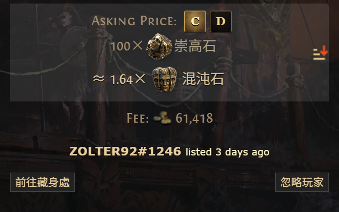
</p>

汇率来自 Poe2Scout，并根据当前市集赛季获取；数据可能延迟，仅用于辅助判断。

<a id="getting-started"></a>
## 开始使用

### 前置条件

- 可加载扩展的 Chrome 或 Chromium 浏览器。

### 安装发布包

推荐从 [GitHub Releases](https://github.com/WAY29/poe2-marketwright/releases) 下载已构建的版本。

1. 在 [GitHub Releases](https://github.com/WAY29/poe2-marketwright/releases) 下载最新 zip 文件。
2. 将 zip 解压到本地目录。
3. 打开 `chrome://extensions`。
4. 开启右上角的 `Developer mode`。
5. 点击 `Load unpacked`。
6. 选择刚才解压出的目录。

### 从源码加载

1. 打开 `chrome://extensions`。
2. 开启右上角的 `Developer mode`。
3. 点击 `Load unpacked`。
4. 选择此仓库根目录。

<a id="data"></a>
## 数据与本地化

### 刷新扩展数据

在仓库根目录执行：

```bash
uv run --project scripts python scripts/poe2_scraper.py scrape --scope all --split-dir build/all-affixes-split --out build/all-affixes-all.json --pretty
uv run --project scripts python scripts/build_extension_data.py --split-dir build/all-affixes-split --out data/affix-filter-data.json
```

`data/affix-filter-data.json` 是生成文件，应通过上述命令刷新，而不是手工修改。

### 数据来源

- [PoE2DB Modifiers](https://poe2db.tw/us/Modifiers) 及其类别页面，例如 [Amulets](https://poe2db.tw/us/Amulets#ModifiersCalc)。
- 官方国际服 Trade API：[`items`](https://www.pathofexile.com/api/trade2/data/items)、[`stats`](https://www.pathofexile.com/api/trade2/data/stats)、[`static`](https://www.pathofexile.com/api/trade2/data/static) 和 [`filters`](https://www.pathofexile.com/api/trade2/data/filters)。
- 官方国服与台服对应的 `https://poe.game.qq.com/api/trade2/data/*` 和 `https://pathofexile.tw/api/trade2/data/*` 接口。构建期会按稳定 ID 对齐三地数据。
- PoE2DB 的公开物品分类页，包括 [Stackable Currency](https://poe2db.tw/us/Stackable_Currency)，用于按 slug 验证通货、宝石、遗物等 Trade 物品名称。
- [Poe2Scout Reference Currencies](https://api.poe2scout.com/poe2/Leagues/{league}/ReferenceCurrencies)，用于 E/C/D 报价换算。

### 汉化覆盖率

当前生成的 Trade 本地化数据包覆盖：

- 物品显示名：简体中文 `2198/2200`（99.91%），繁体中文 `2200/2200`（100%）。
- Trade 词缀模板：简体中文 `8057/8141`（98.97%），繁体中文 `8059/8141`（98.99%）。

以上统计只覆盖总数固定的物品名与词缀模板。原生 Trade 界面文本由各区域 Trade API 动态提供，因此没有固定总数。

<a id="license"></a>
## 许可

本项目以 [MIT License](LICENSE) 发布。

<a id="acknowledgments"></a>
## 致谢

- [PoE2DB](https://poe2db.tw/us/) 提供词缀过滤所需的词缀与物品类别数据。
- [Poe2Scout](https://poe2scout.com/) 提供报价换算所需的参考通货汇率。

<p align="right">(<a href="#readme-top">返回顶部</a>)</p>
